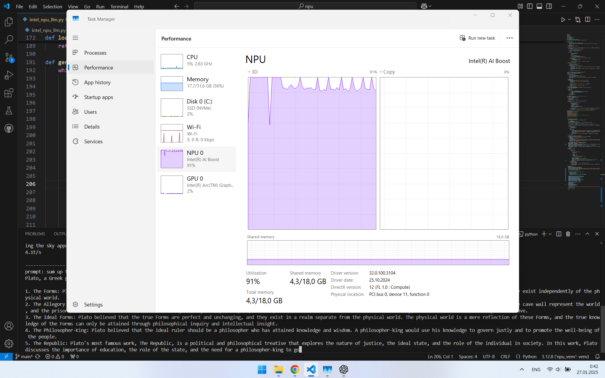

## Features 🌟

- **Default models list**:
  - meta-llama/Meta-Llama-3.1-8B-Instruct
  - microsoft/Phi-3-mini-4k-instruct
  - Qwen/Qwen2-7B
  - mistralai/Mistral-7B-Instruct-v0.2
  - openbmb/MiniCPM-1B-sft-bf16
  - TinyLlama/TinyLlama-1.1B-Chat-v1.0
- **User can input any model they like**
  - No guarantee any model will compile for the NPU, though
  - [here is a list of models likely to run on NPU](https://docs.openvino.ai/2024/about-openvino/performance-benchmarks/generative-ai-performance.html)
- **One-Time Setup**: The script downloads the model, quantizes it, converts it to OpenVINO IR format, compiles it for the NPU, and caches the result for future use. 💡⌛
- **Performance**: Surprisingly fast inference speeds, even on devices with modest computational power (e.g., my Meteor Lake's 13 TOPS NPU). ⚡⏳
- **Power Efficiency**: While inference might be faster on a CPU or GPU for some devices, the NPU is significantly more energy-efficient, making it ideal for laptops. 🔋🌐

<details>

<summary>Screenshot</summary>



As you can see, It's using NPU for text generation.

</details>

## Requirements ✅

- Python **3.9** to **3.12**
- An Intel processor with an NPU:
  - Meteor Lake (Core Ultra Series 1, i.e., 1XX chips)
  - Lunar Lake (Core Ultra Series 2, i.e., 2XX chips)
  - Arrow Lake (Core Ultra Series 2, i.e., 2XX chips)
- Newest Intel NPU driver
  - [Windows](https://www.intel.com/content/www/us/en/download/794734/intel-npu-driver-windows.html)
  - [Linux](https://github.com/intel/linux-npu-driver/releases/)

## Installation 🌐

### Step 1: Clone the Repository 🔗

```bash
git clone https://github.com/justADeni/intel-npu-llm.git
cd intel-npu-llm
```

### Step 2: Create a Virtual Environment 🔢

```bash
python -m venv npu_venv
```

### Step 3: Activate the Virtual Environment ⚛️

- On Windows:
  ```bash
  npu_venv/Scripts/activate
  ```
- On Linux:
  ```bash
  source npu_venv/bin/activate
  ```

### Step 4: Install Dependencies 📁✔️

```bash
pip install -r requirements.txt
```

### Step 5: Run the Script 🔄⚡

```bash
python intel_npu_llm.py
```

## Notes ℹ️

- **Resource-Intensive Compilation**: The quantization and compilation steps can be time-consuming, taking up to tens of minutes depending on your hardware. However, these steps are performed only once per model and are cached for future use. ⌛⚙️
- **Performance**: Despite the resource-intensive setup, inference is optimized for NPUs and provides acceptable performance, even on modest hardware. ✨⏳

## Contributing ⭐

Contributions, bug reports, and feature requests are welcome! Feel free to open an issue or submit a pull request. 🔨✍️

## License 🔓

This project is licensed under the [MIT License](LICENSE). 🔒✨

---

Enjoy using `intel-npu-llm` ! For any questions or feedback, please reach out or open an issue on GitHub. ✨🔧
