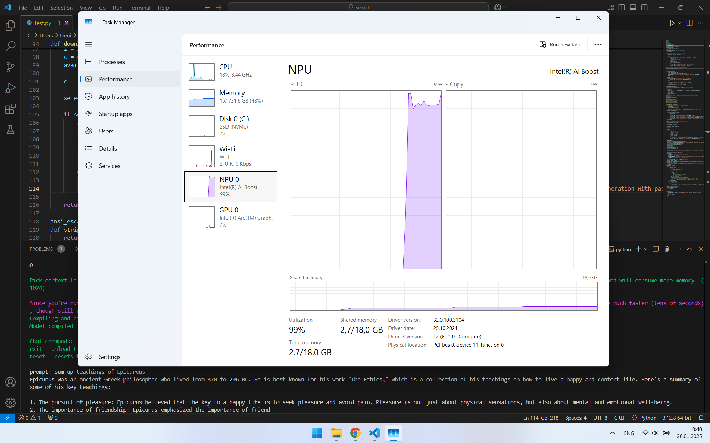

# npu-llm 🧠⚡

Run, quantize and serve large language models on your **Intel NPU** — from a single, modern CLI.

Built on [OpenVINO GenAI](https://docs.openvino.ai/). Pulls a HuggingFace model, quantizes it to
**symmetric int4**, compiles it for the NPU (caching the compiled blob for fast reloads), and lets you
**chat**, **serve an OpenAI-compatible API**, and **watch live NPU usage** — composably.

```bash
npu-llm --model tinyllama                        # chat in the terminal
npu-llm --model tinyllama --serve 4444           # OpenAI-compatible API on :4444
npu-llm --model tinyllama --serve 4444 --display # ...plus a live NPU dashboard
```

## Features

- **Pull + quantize to sym-int4** for the NPU, with one command (`--pull`). Pre-quantized OpenVINO
  models are downloaded as-is.
- **Blob cache** — the first run compiles the model for the NPU (minutes); every run after loads the
  cached `.blob` in seconds.
- **Run by alias** — `--model qwen3-4b-thinking`, or pass any HuggingFace repo id.
- **OpenAI-compatible API** — `--serve <port>` exposes `/v1/chat/completions` (streaming + non-streaming),
  `/v1/completions` and `/v1/models`. Point any OpenAI client at it.
- **Live usage dashboard** — `--display` shows NPU utilization, a rolling sparkline, tokens/s, TTFT and
  totals, in the terminal.

<details>

<summary>Screenshot</summary>



As you can see, it's using the NPU for text generation.

</details>

## Requirements

- **Python ≥ 3.10**
- An **Intel Core Ultra** CPU with an NPU (Meteor Lake / Arrow Lake / Lunar Lake).
- The latest **Intel NPU driver**
  ([Windows](https://www.intel.com/content/www/us/en/download/794734/intel-npu-driver-windows.html) ·
  [Linux](https://github.com/intel/linux-npu-driver/releases/)).

## Install

```bash
git clone https://github.com/justADeni/intel-npu-llm.git
cd intel-npu-llm

python -m venv .venv
# Windows:  .venv\Scripts\activate
# Linux:    source .venv/bin/activate

pip install -e .          # installs the `npu-llm` command
```

## Usage

```
npu-llm --info                    # show the detected NPU
npu-llm --list                    # built-in aliases + what's cached locally
npu-llm --pull tinyllama          # download + quantize to sym-int4, then exit
npu-llm --model tinyllama         # run it (auto-pulls if needed) and chat
npu-llm --model tinyllama --serve 4444 --display
npu-llm --display                 # NPU monitor only (no model)
```

Flags:

| Flag | Meaning |
|------|---------|
| `-m, --model <alias\|repo>` | Model to run/serve (auto-prepares if missing). |
| `--serve <port>` | Expose an OpenAI-compatible API on `<port>`. |
| `--host <addr>` | Bind host for `--serve` (default `127.0.0.1`). |
| `--display` | Live NPU/usage dashboard. |
| `--pull <alias\|repo>` | Download + quantize a model, then exit. |
| `--list` | List built-in aliases and cached models. |
| `--info` | Print NPU hardware summary. |
| `--ctx <n>` | Max prompt/context length (default `1024`). Larger = slower compile, more memory. |
| `--compact <pct>` | In chat, auto-summarize the conversation when it reaches `pct`% of `--ctx`, so long chats never hit a context-overflow reset (e.g. `--compact 80`). |
| `--quant <sym-int4\|int4\|int8>` | Weight format for export (default `sym-int4`). |
| `--device <NPU\|CPU\|GPU>` | OpenVINO device (default `NPU`; CPU/GPU for debugging). |

### Built-in aliases

| Alias | Model |
|-------|-------|
| `tinyllama` | TinyLlama/TinyLlama-1.1B-Chat-v1.0 |
| `qwen3-4b-thinking` | Qwen/Qwen3-4B-Thinking-2507 |
| `phi-3.5-mini` | microsoft/Phi-3.5-mini-instruct |
| `phi-4-mini` | microsoft/Phi-4-mini-instruct |
| `mistral-7b` | OpenVINO/Mistral-7B-Instruct-v0.3-int4-cw-ov (non-gated, pre-quantized) |

Any other value is treated as a raw HuggingFace repo id (gated models will prompt for a token).

### Using the API

```bash
curl http://127.0.0.1:4444/v1/chat/completions \
  -H 'Content-Type: application/json' \
  -d '{"model":"tinyllama","messages":[{"role":"user","content":"Say hi in one word."}]}'
```

Or with the OpenAI Python client:

```python
from openai import OpenAI
client = OpenAI(base_url="http://127.0.0.1:4444/v1", api_key="not-needed")
print(client.chat.completions.create(
    model="tinyllama",
    messages=[{"role": "user", "content": "Hello!"}],
).choices[0].message.content)
```

### Chat commands

`exit` quit · `reset` clear context · `npuinfo` show NPU stats.

### Long chats: auto-compaction

By default, when a conversation exceeds `--ctx` the chat resets and loses history. With `--compact`,
the context is tracked and — once it reaches the given percentage of `--ctx` — the model summarizes
the conversation so far, and the chat restarts seeded with that summary (installed as the session's
system message). The chat then continues indefinitely without a hard overflow:

```bash
npu-llm --model qwen3-4b-thinking --ctx 4096 --compact 80
```

A hard-overflow safety net still resets the chat in the rare case the estimate is off, so it never
crashes.

## How it works

1. **Prepare** — `optimum-cli export openvino --weight-format int4 --sym` produces an OpenVINO IR model,
   stored under the user cache dir (`%LOCALAPPDATA%\npu-llm\Cache` / `~/.cache/npu-llm`; override with
   `$NPU_LLM_HOME`).
2. **Compile + cache** — on first load the model is compiled for the NPU and exported to a `.blob`
   (keyed by model + context length). Later loads read the blob directly.
3. **Run / Serve / Display** — a single `openvino_genai.LLMPipeline` on the `NPU` device drives chat, the
   API, and the dashboard. The NPU processes one generation at a time, so API requests are queued.

## Notes

- First-time compilation is CPU/RAM intensive and can take minutes; it's cached afterwards.
- Larger models (7B) are near the ceiling for a ~13-TOPS NPU. Start with `tinyllama` to validate.

## Contributing

Contributions, bug reports, and feature requests are welcome! Feel free to open an issue or submit a pull request.

## License

[MIT](LICENSE)
